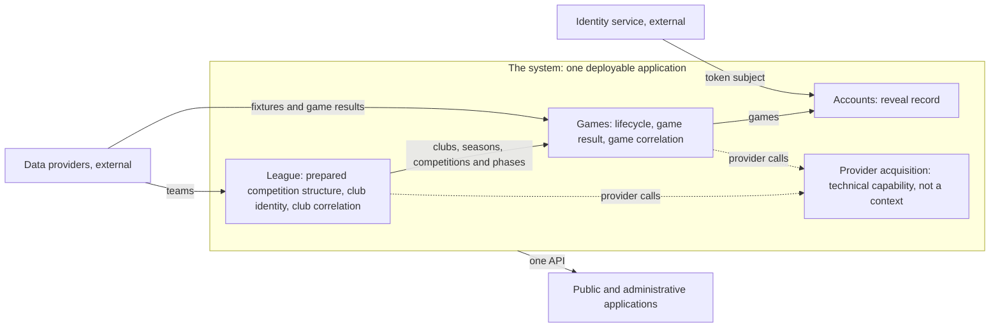

# ADR-0005: Bounded contexts

- **Status:** Accepted
- **Date:** 2026-09-29
- **Release / context:** The first release; the contexts its first features need, with the rest of the context set left open
- **Related:** [ADR-0003, Modular monolith architecture](0003-modular-monolith-architecture.md) (the style these contexts live in); [ADR-0004, Two client applications, chosen against their own constraints](0004-client-architecture.md) (the API these contexts serve); the [system description](../system-description.md); the [requirements](../requirements.md); the [glossary](../glossary.md)

## Context

The system keeps three kinds of information that differ in their rules, their language and their lifecycle.

The first is the competition structure, the data each league season is set up from: its competitions and their phases, the clubs that take part and how the league groups them. It is prepared as data rather than code, with no screen for editing it, as the [Phase One scope](../phase-one-scope.md) states.

The second is the games. A game arrives as a fixture, passes through five statuses and ends with a game result, and three independent writers can change it: the clock, the refresh of the schedule and the collection of the game result. Their changes must not contradict one another.

The third is the state the system keeps for a Logged-in user. It lasts as long as the account and is personal data that never enters a shared payload or cache, as [Viewing-Data Privacy](../requirements.md#viewing-data-privacy) requires. Game results and what a reader has revealed must stay apart for the spoiler-free guarantee to hold.

[ADR-0003, Modular monolith architecture](0003-modular-monolith-architecture.md) decides that the backend is a modular monolith whose bounded contexts are packages, and does not say which contexts exist. This record does, for the contexts the first features need. It does not decide product behaviour: the system description and the requirements do, and this record cites them as context.

## Decision

**1. Three bounded contexts to begin with, and no further context is defined here.** A context is justified by its rules, its language and its lifecycle, never by how it would be stored. The word team is context-local: League speaks of clubs, and Games of the two teams of a game.

- **League.** The prepared competition structure of each league season, and the lasting identity of the clubs that take part.
  - **Holds.** For each season of a league: the competitions and their ordered phases; each club's placement in the season, with its conference and division, held once per club, league and season; each club's participation in a competition, held separately, which repeats neither the conference nor the division and may place the club further inside the competition, as a Cup group assignment places a club inside the Cup's group stage; and whether the season is the league's current season. It also holds each club's lasting identity, and the correlation of that identity with the providers' references (rule 5).
  - **Decides.** Whether a club takes part in a season and in which conference and division, whether a competition or a phase exists in a season, and whether a season is current. League alone creates and ends a season, and everything else refers to it.
  - **Does not own.** Games or schedules, game results, the standings computation, or players, rosters and player availability. Where those belong is not decided here.
  - **Why.** The competitions a season holds are fixed per league and season, a league has one current season, conference and division come from the prepared structure and never from a provider, and a club enters the system only through the prepared data. League is reference data with validation when it is loaded, and it has little other behaviour.

- **Games.** Each game as one contest through its whole lifecycle.
  - **Holds.** The game, which arrives as a fixture and persists; its recognition; its status and the guards on each change of status; its placement in a competition and a phase; its game result; and the correlation of the game with each provider's reference (rule 5).
  - **Decides.** Whether a described fixture is a game already known or a new one, whether a change of status is legal, and whether a game result may be stored.
  - **Does not own.** Which clubs exist (League), which tables a game feeds (where the standings belong is not decided here), what a reader has revealed (Accounts), or the provider allowances (provider acquisition, rule 2).
  - **Why.** A rule boundary of its own around the changes of status and the game result, a language of its own (fixture, game, status, game result), and the three writers named above.

- **Accounts.** The state the system keeps for a Logged-in user.
  - **Holds.** What the system keeps for a Logged-in user and deletes with the account: first the reveal record; later the two default game result visibility settings, the display preferences, the favourite team and feedback, each a record with a lifecycle of its own.
  - **Decides.** Whether this reader has revealed this game.
  - **Does not own.** The effect of a reveal on the loaded page, a Guest's memory of a reveal (which lives in the loaded page and is never stored), the composed visibility a surface shows, game results, or what counts as outcome-bearing information, which [What Outcome-Bearing Means](../requirements.md#what-outcome-bearing-means) defines.
  - **Why.** A lifecycle bound to the account, which [Reveal Records Are Kept Indefinitely](../requirements.md#reveal-records-are-kept-indefinitely) states for the reveal record, and personal data that never enters a shared payload or cache. The context is named Accounts and not User, because USER is a role name and the identity service also manages users, so the word would carry three meanings.

**2. What is not a bounded context.** Provider acquisition is a technical capability: the governance of the provider allowances, the routing of requests, the raw archive of saved provider responses, and the one client through which the system reaches the providers. It has no domain language, owns no domain identity and holds no correlation, and the provider adapters of League and Games use it. The Scheduler is not a context: it is a driving adapter that calls a context on a clock. The identity service is an external system outside the system boundary. This record does not place standings, highlights, search, or player identity with rosters and availability, and it does not decide whether the capabilities the Administrator uses to operate the system, the ingestion failure log among them, form a context of their own.

**3. The context map and the direction of dependency.** Solid arrows run from the supplier of information to its consumer; dotted arrows run from a caller to the capability it calls.

League is upstream of Games, and Games is upstream of Accounts. A downstream context refers to an upstream one by identity and asks it questions through what the upstream context publishes at the root of its package, and the upstream context knows nothing of it. Which questions a context answers is decided when the first downstream context needs the answer. League depends on no other context. Games never depends on Accounts. Provider acquisition depends on no context, and the provider adapters call it. Each provider is reached through an adapter in the context that consumes its data; the adapter checks the provider's response, translates it into that context's own language and resolves the provider's references through the context's correlation before anything reaches the domain. The identity service is reached the same way through an adapter in Accounts, which keeps the token's subject apart from the account's own identity (rule 4). One API serves both client applications.

To begin with, no shared kernel exists between the contexts and no domain event crosses a context, because no consumer exists yet. Contexts integrate by synchronous in-process queries.

**4. Identity.** Four kinds of identity are kept apart, and none is derived from another.

| Kind | Means |
|---|---|
| Domain identity | What makes a thing the same thing through all its changes. The platform assigns it, it is opaque, and it belongs to the context that owns the thing |
| Business uniqueness | A rule that no two things share certain values at a given time. It is used to recognise a thing already known, and it may change over the thing's life |
| Persistence identity | How the database keys a record. It may coincide with a domain identity by a decision made where the record is stored, never by assumption |
| External identity | A reference used by a provider or by the identity service |

A club's domain identity is its lasting identity as the prepared data defines it, holding across seasons; a rename changes an attribute and leaves the identity as it is. A game's domain identity is assigned when a fixture is first recognised as a new game, and it survives every date move, every change of placement and every change of the provider that describes the game. It is never the data by which the game is recognised, never a provider's reference and never a storage key. Recognition, the rule by which Games decides that a described fixture is a game it already knows, is business uniqueness and not identity, and it never reads the game's date, so a game remains the same contest through any date move. An account's domain identity is the platform's own: the identity service's subject is correlated to it and never becomes it.

**5. Correlation.** A provider's reference is an external identity. A correlation maps an external identity to a domain identity, never the reverse. Nothing in any domain model carries a provider reference, and a provider reference is never a domain identity. Each owner holds its own correlation: it is written atomically with the identity it points to, only the owner knows its identities, and a map held in provider acquisition would make a technical component know every context's identities. League holds the correlation of its clubs, with the prepared data, so that each club's references at each provider sit beside the club and form no part of its identity. Games holds the correlation of its games, beside the game and not inside it. Whichever context holds player identity, later, holds the player correlation. The provider reports teams; the system resolves those reports against clubs that already exist in League; the provider never creates a club's domain identity. A reported team that matches no club leaves a record in the ingestion failure log and stores nothing.

**6. Serving.** The responses the contexts supply fall into three classes. The day's listing comes from Games, is shared and cacheable, and carries nothing outcome-bearing. One game's game result comes from Games, is an explicit ask, is identical for every reader who asks, and is shared and cacheable. The reveal layer comes from Accounts, is scoped to one reader and private, and carries game identities only. A game result never travels in a response scoped to one reader. Every layer is safe on its own, and each producer of a response scoped to one reader is a resource of its own that fails on its own, so that a failure leaves games hidden and never discloses one. A game's identity in the API is its domain identity, an opaque value. [ADR-0004, Two client applications, chosen against their own constraints](0004-client-architecture.md) says where the layers are composed.

## Consequences

- This record defines the contexts and does not say which of them exist in code. League is built first, with the complete prepared competition structure of a season; each club's references at the providers join it as its correlation when the provider work needs them. Games, with the correlation of its games, and Accounts are built with the work that first needs them.
- Rules the contexts carry, enforced by architecture tests as [ADR-0003, Modular monolith architecture](0003-modular-monolith-architecture.md) requires, once the subject of each rule exists: no domain type carries a provider reference; League depends on no other context; Games has no dependency on Accounts; no response scoped to one reader contains a game result; the reveal layer and, later, the settings are separate resources.
- A game can exist without complete recognition, as a fixture added during the season and not yet placed, and its recognition can grow when it is placed. That is why recognition cannot serve as identity.
- Left open, deliberately: where standings, highlights, search, and player identity with rosters and availability belong; whether the capabilities the Administrator uses to operate the system form a context of their own; the relationship between every pair of contexts beyond those named here; the contents of a shared kernel, if one is ever needed; and how contexts interact once an event has a consumer.
