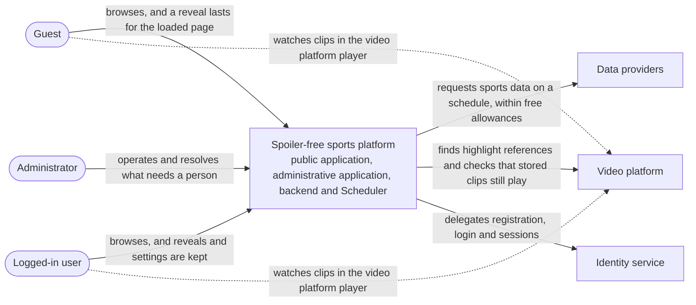
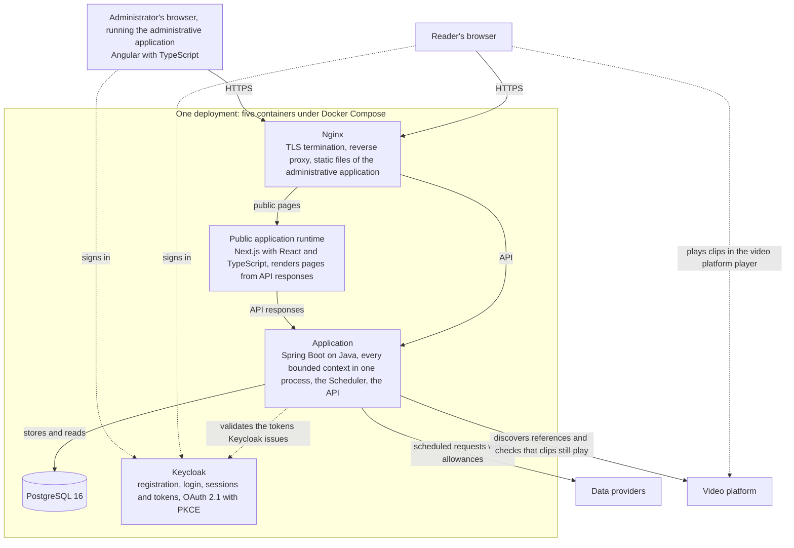

# Architecture overview

> ### Status
>
> This document describes the designed architecture. No application code exists yet: what follows
> is decided, not built, and it covers only what is settled. Which bounded contexts the application
> will hold is not yet decided, so this document names none.

## Driving architectural characteristics

Four characteristics drive the design of the first release: the structure is optimised for them, and each entry below names what holds the design to it. [ADR-0002, Additive and driving architectural characteristics](adr/0002-additive-and-driving-architectural-characteristics.md) sets out the bands that place them here, and what the first release invests in the characteristics it does not drive.

- **Reliability.** Every reader-facing read is served from stored data, so a provider outage delays only how fresh that data is and changes nothing a reader sees, as [Serving Is Local](requirements.md#serving-is-local) requires, and everything that needs a person is recorded in one place, the ingestion failure log, which the [system description](system-description.md) places inside the system boundary.
- **Quota-efficiency and cost governance.** How often and how much the system requests from the providers is limited by the free allowances they offer rather than by reader demand, the first of the three constraints the [system description](system-description.md) states.
- **Testability.** The guarantee that outcome-bearing information starts hidden, [Hidden Everywhere by Default](requirements.md#hidden-everywhere-by-default), has to be verifiable on every surface that can carry it, and in-process module calls need no network mocking, a consequence [ADR-0003, Modular monolith architecture](adr/0003-modular-monolith-architecture.md) records.
- **Modularity.** Boundaries between contexts are enforced by architecture tests rather than by convention, as the consequences of [ADR-0003, Modular monolith architecture](adr/0003-modular-monolith-architecture.md) state.

## Style

The backend is a domain-partitioned modular monolith, as [ADR-0003, Modular monolith architecture](adr/0003-modular-monolith-architecture.md) decides: one deployable application, with bounded contexts as top-level packages, hexagonal (ports and adapters) layering inside each, and boundaries that are enforced but not distributed. Enforcement is by architecture tests rather than by convention. The quota governor and the provider machinery run in the same process, and no context is split into a separately deployable service in the first release. Clean boundaries keep the option of splitting a context, a competition or a league out later, when load justifies it.

Two client applications consume the backend's API, as [ADR-0004, Two client applications, chosen against their own constraints](adr/0004-client-architecture.md) decides: a public application for readers, reachable without signing in, and an administrative application for the Administrator, behind a login. Neither is a second backend, neither reaches the database, and spoiler safety is not implemented in either: it stays in the read model, so a response carries outcome-bearing values only for what the reader has asked for.

## System context

The actors are those of the [system description](system-description.md). The Scheduler is part of the system rather than an outside party: it starts the work no outside party asks for, on a clock or in reaction to a change the system has just recorded, so it appears inside the system below.

Requests to the data providers and the video platform happen on the Scheduler's schedule or when the Administrator starts provider work, never because of anything a reader does; every reader-facing read is served from what the system has stored. Highlight videos are never hosted by the system: a reader watches a clip in the video platform's own player, and the system stores only the reference. User identity management is outside the system, handled by the identity service; the system recognises a logged-in user by the token that service issues.

## Containers

The system will deploy as five containers under Docker Compose, as the [technical decisions](technical-decisions.md) state. The administrative application is not a container of its own: Nginx will serve its static build, and it will run in the Administrator's browser.

Solid arrows are request paths the decisions state; dotted arrows are relationships whose network path is not part of any published decision. The [technical decisions](technical-decisions.md) are the authoritative home of the technology each container runs; the table below gives what each container is responsible for.

| Container | Responsibility |
|---|---|
| Application | The backend: every bounded context in one process; the API both client applications consume; the Scheduler's work, which collects data from the providers within their allowances, discovers highlight references and brings derived data such as the standings up to date; the logic that decides what can be shown to a reader without revealing a hidden outcome, in the read model; validation of the tokens the identity service issues |
| Database | Stored sports data and the standings computed from it, the competition structure prepared for each season, reveal records, settings and feedback, the facts the Administrator enters, and the ingestion failure log |
| Identity | Registration, login, password reset, user sessions and the token lifecycle |
| Public application runtime | Server rendering of the public application's pages from API responses, public cacheability, and static generation for content that changes rarely; no business logic and no data access of its own |
| Web server | TLS termination; reverse proxy for the API and the public application; static files of the administrative application |

## Relationships with external systems

- **Data providers.** External services that supply events, scores, statistics, standings and other sports data. The system requests data from them on a schedule, within the free allowances they offer, and a reader's browsing never causes a request. Every response is checked before anything is stored, and a saved copy is kept privately so that stored data can be rebuilt without new requests. A provider outage delays how fresh the stored data is and changes nothing a reader sees.
- **Video platform.** Hosts the highlight videos, which are created and published by others; in Phase One it is YouTube. The system stores a reference to a clip only if the platform marks it as public and embeddable when it is stored, re-checks that stored clips still play, and shows a clip through the platform's own player in the reader's browser. It never re-hosts or re-uploads a video.
- **Identity service.** Keycloak performs registration, login, password reset and session management, outside the system boundary. It is deployed as one of the system's containers and the system prepares its realm, and being deployed alongside does not place it inside the boundary, because the system implements none of what it does. The application validates the tokens Keycloak issues on every protected endpoint; the system has two roles, USER and ADMIN, as the [requirements](requirements.md#authorization) state, and authorization is deny-by-default, so an endpoint with no explicit rule is refused, as the [technical decisions](technical-decisions.md) state.

## Where to read more

- The [system description](system-description.md): the problem, the purpose, the constraints, the actors and the boundary.
- The [Phase One scope](phase-one-scope.md): what the first version delivers and what it leaves out.
- The [requirements](requirements.md): the behaviour the published specification requires.
- The [technical decisions](technical-decisions.md): the technical baseline implementation must respect.
- The decision records [ADR-0001](adr/0001-record-architecture-decisions.md), [ADR-0002](adr/0002-additive-and-driving-architectural-characteristics.md), [ADR-0003](adr/0003-modular-monolith-architecture.md) and [ADR-0004](adr/0004-client-architecture.md): why the foundational choices were made and what they cost.
